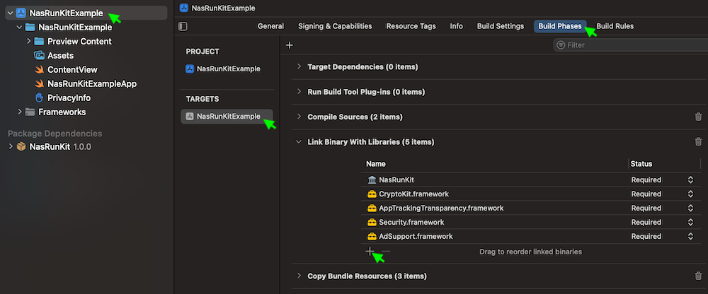

# NasRun iOS 연동 가이드

## 목차
- [1. 개요](#1-개요)
- [2. 설치](#2-설치)
  - [2-1. SDK 파일 추가](#2-1-sdk-파일-추가)
  - [2-2. 라이브러리 추가](#2-2-라이브러리-추가)
  - [2-3. 추적 권한 허용 표시 문구 설정](#2-3-추적-권한-허용-표시-문구-설정)
  - [2-4. Privacy Manifest 설정](#2-4-privacy-manifest-설정)
- [3. SDK 사용](#3-sdk-사용)
  - [3-1. SDK 호출](#3-1-sdk-호출)
  - [3-2. 호출 시점](#3-2-호출-시점)
- [4. 연동 확인](#4-연동-확인)
- [5. 예제 프로그램](#5-예제-프로그램)
- [🔗⠀다른 플렛폼 SDK](#-다른-플렛폼-sdk)

## 1. 개요
`NasRun SDK`는 iOS 앱의 실행형/미션형 광고를 진행하기 위한 SDK 입니다.

## 2. 설치

### 2-1. SDK 파일 추가
`/sdk` 폴더에 있는 `NasRunKit.xcframework` 파일을 프로젝트에 추가합니다.


### 2-2. 라이브러리 추가
`프로젝트 설정` > `Build Phases` > `Link Binary With Libraries` 에서 다음 라이브러리를 추가합니다.

- NasRunKit.xcframework
- AppTrackingTransparency.framework
- AdSupport.framework
- CryptoKit.framework
- Security.framework



### 2-3. 추적 권한 허용 표시 문구 설정

`Info.plist`에 `Privacy - Tracking Usage Description` 키를 추가한 후, 추적 권한 허용을 위한 표시 문구를 입력합니다. 문구는 앱의 성격에 맞게 변경할 수 있습니다.

- 추천 문구 : `앱이 귀하의 광고 참여여부 확인을 위한 목적으로 IDFA에 접근하려고 합니다.`


### 2-4. [Privacy Manifest](https://developer.apple.com/documentation/bundleresources/privacy_manifest_files) 설정

`/sdk` 폴더에 있는 `PrivacyInfo.xcprivacy` 파일에 SDK가 사용하는 Privacy Manifest 정보가 포함되어 있습니다.

귀사의 `PrivacyInfo.xcprivacy` 파일에 내용을 추가하거나, `/sdk` 폴더에 있는 파일을 사용하시기 바랍니다.

## 3. SDK 사용

### 3-1. SDK 호출
- Swift
  ```swift
  import NasRunKit

  NasRun.run("32자리 광고 KEY")
  ```
  
- Objective C
  ```objc
  #import "NasRunKit/NasRunKit.h"

  [NasRun run:@"32자리 광고 KEY"];
  ```

### 3-2. 호출 시점

#### 실행형 광고
- 앱의 실행 시점에 호출합니다.

#### 미션형 광고
- 로그인, 레벨 달성등의 미션형 광고일 경우, 해당 미션의 **완료 시점**에 호출합니다.
- 미션 완료 이후에는 앱 **실행 시점**에 미션 완료 여부를 확인하여 다시 호출해야합니다.
- 미션 완료 시점에만 1회 호출하면, 인터넷 연결 문제등으로 참여가 정상적으로 완료되지 않을 수 있습니다.

## 4. 연동 확인

SDK 호출 후 [연동 확인 홈페이지](https://ow.appang.kr/sdk/connected)에 접속하여 광고 KEY를 입력하면 연동 결과를 확인할 수 있습니다.

> 연동이 완료된 경우, 미연동 상태로 변경할 수 있는 기능을 제공합니다.
> 
> SDK 호출로 서버와 통신이 완료되면, 다시 SDK를 호출해도 서버와 통신이 이루어지지 않습니다. 앱 삭제 후 재설치하여 SDK를 호출해야 정상적으로 연동됩니다.


## 5. 예제 프로그램
예제 프로그램은 `/examples` 폴더에 있습니다.

- [Swift 예제](examples/Swift)
- [Objective C 예제](examples/ObjectiveC)

## 🔗 다른 플렛폼 SDK
- [`Android SDK`](https://github.com/mafin-global/nas-run-android)
